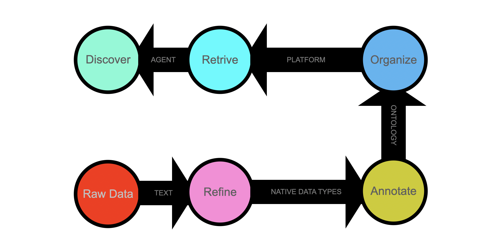
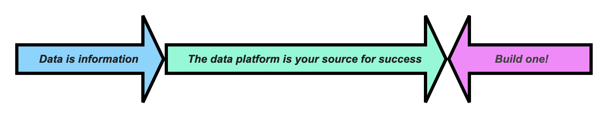

# Mario Foglio

**Discovery Platform Creator · Systems Designer · Founder @ Quantome SAS**

*Blending logic, complex organic systems, and aesthetics to boost AI — I transform disorderly files into refined data assets.*

At the data source, I focus on data refinement and automation, preserving information accuracy while converting abstract data into structured, interoperable platforms that can be run, stored, scaled, and visualized.

Whether for advanced biotech research or business applications, I help build computer resources that organize data in one place—portable, labeled, and instantly accessible.

## What I Build

**Go Data Platform** — 100+ Go programs and the [Go Interlace](https://github.com/sas-quantome) library that process data from diverse open-access sources into a unified, queryable Go data stack.

**AI Agents** — Autonomous agentic systems capable of writing and deploying complete [Go Interlace](https://github.com/sas-quantome) applications.

**Data Pipelines** — End-to-end workflows, e.g., DNA sequencing analysis, data integration, ontology annotation, entity recognition, and entity discovery.

## Core Stack

| Layer              | Tools                                                                                             |
|--------------------|---------------------------------------------------------------------------------------------------|
| **Language**       | Go (primary), Python (ML), C/C++, SQL, HTML, CSS and others left behind                           |
| **Platform**       | Go Interlace (open-source core library), Google Cloud, GitHub                                     |
| **AI / Agents**    | Claude, Gemini, local LLMs (e.g. Gemma)                                                           |
| **Development**    | Antigravity, Gemini CLI, JetBrains, NotebookLM, DavinciResolve                                    |
| **Bioinformatics** | Sequence Alignment & Homology, Variant Calling, Molecular Modeling, Visualization, Quantification |
| **Data Formats**   | GFF3, GFF, VCF, JSON, YAML, GVF, BED, PED, XML, FASTA, FASTQ, PDB, GenBank, etc.                  |

## Current Data

### Gene, Protein & Disease
[STRING DB](https://string-db.org/) · [Reactome](https://reactome.org/) · [UniProt](https://www.uniprot.org/) · [Gene DB](https://www.ncbi.nlm.nih.gov/gene/) · [Gene Ontology](https://www.geneontology.org/) · [Human Phenotype Ontology](https://hpo.jax.org/) · [Mondo Disease Ontology](https://mondo.monarchinitiative.org/)

### Clinical DNA Variation
[ClinVar](https://www.ncbi.nlm.nih.gov/clinvar/) · [dbSNP](https://ftp.ncbi.nih.gov/snp/latest_release/JSON/) · [dbVar](https://ftp.ncbi.nlm.nih.gov/pub/dbVar/data/Homo_sapiens/) · [ALFA](https://ftp.ncbi.nih.gov/snp/population_frequency/latest_release/) · [GWAS Catalog](https://www.ebi.ac.uk/gwas/) · [EBI Ancestry](https://www.ebi.ac.uk/gwas/docs/ancestry-data) · [DeepMind AlphaMissense](https://deepmind.google/blog/a-catalogue-of-genetic-mutations-to-help-pinpoint-the-cause-of-diseases/) · [MedGen](https://www.ncbi.nlm.nih.gov/medgen/) · [GenAge](https://genomics.senescence.info/genes/index.html)

### Molecular Annotation
[NCBI Genomes](https://ftp.ncbi.nih.gov/genomes/refseq/vertebrate_mammalian/Homo_sapiens/annotation_releases/current/) · [RefSeq](https://ftp.ncbi.nlm.nih.gov/refseq/H_sapiens/) · [Ensembl Transcriptome](http://ftp.ensembl.org/pub/current_gff3/homo_sapiens/)/[Regulome](http://ftp.ensembl.org/pub/current_regulation/homo_sapiens/) · [GTEx](https://www.gtexportal.org/home/downloads/adult-gtex) · [RNA Central](http://ftp.ebi.ac.uk/pub/databases/RNAcentral/current_release/) · [UniProtKB](https://ftp.uniprot.org/pub/databases/uniprot/current_release/knowledgebase/) · [EBI GOA](https://www.ebi.ac.uk/GOA/downloads) · [PhenomeXcan](https://zenodo.org/record/3911190/)

## Current Work

- Agentic systems with tool use and memory for generic workflows
- Entity–event–agent architectures for scientific data platforms
- LLM-assisted pipeline generation and self-deploying Go applications

