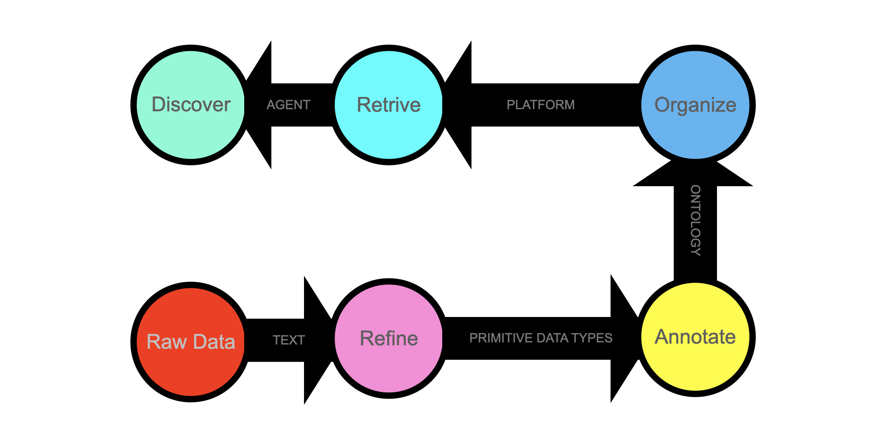

  
# Mario Foglio

**Data Architect · Systems Designer · Founder @ Quantome SAS**

**Transforming massive, noisy information into highly condensed, deterministic, and AI-ready knowledge assets.**

Software in the wild is tested through the unexpected. I don't build theoretical data models; I engineer deterministic data pipelines forged by years of handling massive, fragmented datasets in fast-paced DNA technology centers.

I focus on extreme data refinement—stripping away infrastructure bloat and replacing it with ultra-condensed, parallel-array structures. My goal is to break the gravity of raw data, transforming gigabytes of unstructured "sludge" into lightning-fast, portable formats that can be queried in microseconds and fed natively into AI agent contexts.

Whether for advanced biotech research or enterprise infrastructure, I build the engines that make data instantly accessible, tightly governed, and completely free from vendor lock-in.

## What I Build

* **Proprietary Refinery Engine (`go-interlace`)** — A private suite of 100+ Go programs and deterministic pipelines that refine raw, distributed data into a unified, ultra-condensed Gob data stack. Vertically partitioned, columnar data store that uses parallel arrays to support additive schema evolution. Applies advanced Directed Acyclic Graphs (DAGs) and Standard Operating Procedures (SOPs) to orchestrate multifaceted data consolidation. It persistently monitors processes, parses execution logs, prevents redundant billing runs, and automatically halts cluster submission upon detecting critical anomalies.
* **Public Client Kit (`co-interlace`)** — Open-source Go SDK and a set of command-line tools intended to decode, search, and pipe Gob streams out of the permanent vault directly into downstream transient tools: databases, supercomputers, and local LLMs. 
* **Autonomous Agentic Systems** —  The Interlace codebase has been refactored to support agentic development platforms and enable autonomous AI agents to plan, write, modify, test, and teach them using internal examples to build new applications.
* **Bioinformatics Pipelines** — End-to-end workflows for DNA sequencing analysis, ontology annotation, and massive-scale entity recognition.

## Where to Find More About My Work

Explore the open-source client integration tools and the **co-interlace** benchmark dataset at the [Quantome's GitHub repository](https://github.com/sas-quantome).

## Tech Stack

| Category | Tools & Technologies |
| :--- | :--- |
| **Languages** | Go (storing, streaming), Python (ML), C/C++, SQL |
| **Infrastructure** | Google Cloud Platform, Cloud Run, Elasticsearch, High Perfomance Computing, Ollama |
| **Architecture** | Go Interlace (orchestration, LLM grounding), Deterministic DAGs, Docker, Local Shell CLI |
| **AI Agents** | Claude, Gemini, Gemma (reasoning, tool-use, search) |
| **Bioinformatics** | Sequence Alignment, Variant Calling, Molecular Modeling, Visualization |
| **Data Formats** | Gob, OKF, GFF3, VCF, JSON, YAML, BED, PED, XML, FASTA, PDB |

## Current Data Domains

I have built parsers, encoders, model-based agents, state machines, and deterministic models to handle highly nested datasets:

* **Gene, Protein & Disease:**

  [STRING DB](https://string-db.org/) · [Reactome](https://reactome.org/) · [UniProt](https://www.uniprot.org/) · [Gene DB](https://www.ncbi.nlm.nih.gov/gene/) · [Gene Ontology](https://www.geneontology.org/) · [Human Phenotype Ontology](https://hpo.jax.org/) · [Mondo Disease Ontology](https://mondo.monarchinitiative.org/)
  
* **Clinical DNA Variation:**

  [ClinVar](https://www.ncbi.nlm.nih.gov/clinvar/) · [dbSNP](https://www.ncbi.nlm.nih.gov/snp/) · [dbVar](https://www.ncbi.nlm.nih.gov/dbvar/) · [ALFA](https://www.ncbi.nlm.nih.gov/snp/docs/gsr/alfa/) · [GWAS Catalog](https://www.ebi.ac.uk/gwas/) · [EBI Ancestry](https://www.ebi.ac.uk/gwas/docs/ancestry-data) · [AlphaMissense](https://deepmind.google/blog/a-catalogue-of-genetic-mutations-to-help-pinpoint-the-cause-of-diseases/) · [MedGen](https://www.ncbi.nlm.nih.gov/medgen/) 
  
* **Molecular Annotation:**

  [NCBI Genomes](https://www.ncbi.nlm.nih.gov/home/genomes/) · [RefSeq](https://www.ncbi.nlm.nih.gov/refseq/) · [Ensembl](https://www.ensembl.org/info/data/index.html) · [GTEx](https://www.gtexportal.org/home/downloads/adult-gtex) · [RNA Central](https://rnacentral.org/) · [UniProtKB](https://www.uniprot.org/help/uniprotkb) · [EBI GOA](https://www.ebi.ac.uk/GOA/downloads) · [PhenomeXcan](https://zenodo.org/record/3911190/) · [GenAge](https://genomics.senescence.info/genes/index.html)
  

## Current Focus

**Working on two problems:**

1) LLMs can reason, but they are notoriously terrible calculators. Our Go application can perform the statistics flawlessly. It perfectly holds the retrieved data and the full query context in memory, but it never reasons.

2) LLMs know everything, but organize nothing. Probabilistic agents try, but they lack determinism. 

## See [Quantome's GitHub repository](https://github.com/sas-quantome) for more details on data refinement.

###### July 9, 2026: main readme v90

