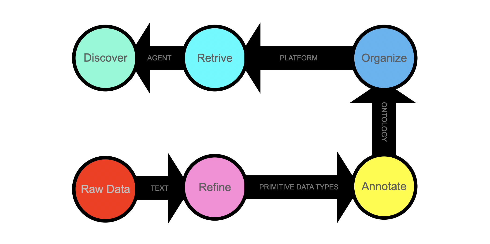

  
# Mario Foglio

**Data Architect · Systems Designer · Founder @ Quantome SAS**

Work here focuses on transforming massive, noisy information into highly condensed, versioned, and AI-ready knowledge assets.

Software in the wild is tested through the unexpected. I don't build theoretical data models; I engineer deterministic data pipelines forged by years of handling massive, fragmented datasets in fast-paced DNA technology centers.

I concentrate on extreme data refinement—stripping away infrastructure bloat and replacing it with ultra-condensed, parallel-array structures. My goal is to break the gravity of raw data, transforming terabytes of unstructured "sludge" into lightning-fast, portable formats that can be queried in microseconds and fed natively into AI agent contexts.

Whether for advanced biotech research or enterprise infrastructure, I build the engines that turn chaotic datasets into vertically partitioned, vendor-agnostic assets—making data accessible in milliseconds, strictly validated at the byte level, and completely free from database lock-in.

## The Interlace Data Stack

* **Interlace Engine (*go-interlace*)** — The proprietary refinery engine, a private suite of 100+ Go programs and deterministic pipelines that refine raw, distributed data into a unified, ultra-condensed Gob data stack. Vertically partitioned, columnar data store that uses parallel arrays to support additive schema evolution. Applies advanced Directed Acyclic Graphs (DAGs) and Standard Operating Procedures (SOPs) to orchestrate multifaceted data consolidation. It persistently monitors processes, parses execution logs, prevents redundant billing runs, and automatically halts cluster submission upon detecting critical anomalies.
* **Interlace SDK (*co-interlace*)** — Open-source Go SDK and a set of command-line tools intended to decode, search, and pipe Gob streams out of the permanent vault directly into standard Linux workflows and downstream transient tools: databases, supercomputers, local LLMs, and edge computing systems. 
* **Autonomous Agentic Systems** —  The **Interlace Codebase** has been refactored to support agentic development platforms and enable autonomous AI agents to plan, write, modify, and test. AI agents can learn from the internal codebase as well as from the data-processing outputs footprinted in the **Entity** and **Event** directory paths, which are core to the **Interlace Architecture**.
* **Bioinformatics Pipelines** — End-to-end workflows for DNA sequencing analysis, ontology annotation, and massive-scale entity recognition.

## The Interlace Codebase

* [**Interlace Architecture**](https://github.com/sas-quantome)
* [**Interlace SDK**](https://github.com/sas-quantome/co-interlace)

## No Data, No Interlace

Development of consolidation, refinement, storage, retrieval, and streaming methods is possible thanks to the data provided by the institutions and people behind these exceptional resources:

* **Gene, RNA, & Protein:**

  [STRING DB](https://string-db.org/) · [Reactome](https://reactome.org/) · [UniProt](https://www.uniprot.org/) · [Gene DB](https://www.ncbi.nlm.nih.gov/gene/) · [RNA Central](https://rnacentral.org/) · [GenBank](https://www.ncbi.nlm.nih.gov/genbank/)
  
* **Clinical DNA Variation:**

  [ClinVar](https://www.ncbi.nlm.nih.gov/clinvar/) · [dbSNP](https://www.ncbi.nlm.nih.gov/snp/) · [dbVar](https://www.ncbi.nlm.nih.gov/dbvar/) · [ALFA](https://www.ncbi.nlm.nih.gov/snp/docs/gsr/alfa/) · [GWAS Catalog](https://www.ebi.ac.uk/gwas/) · [EBI Ancestry](https://www.ebi.ac.uk/gwas/docs/ancestry-data) · [AlphaMissense](https://deepmind.google/blog/a-catalogue-of-genetic-mutations-to-help-pinpoint-the-cause-of-diseases/) · [MedGen](https://www.ncbi.nlm.nih.gov/medgen/) 
  
* **Molecular Annotation:**

  [NCBI Genomes](https://www.ncbi.nlm.nih.gov/home/genomes/) · [RefSeq](https://www.ncbi.nlm.nih.gov/refseq/) · [Ensembl](https://www.ensembl.org/info/data/index.html) · [GTEx](https://www.gtexportal.org/home/downloads/adult-gtex) · [UniProtKB](https://www.uniprot.org/help/uniprotkb) · [EBI GOA](https://www.ebi.ac.uk/GOA/downloads) · [PhenomeXcan](https://zenodo.org/record/3911190/) · [GenAge](https://genomics.senescence.info/genes/index.html)

* **Biomedical Literature, Disease & Ontology:**

  [PubMed](https://pubmed.ncbi.nlm.nih.gov/) · [UMLS](https://www.nlm.nih.gov/research/umls/index.html) · [OBO Foundry](https://obofoundry.org/) · [EMBL-EBI Ontology](https://www.ebi.ac.uk/ols4/) · [Gene Ontology](https://www.geneontology.org/) · [Human Phenotype Ontology](https://hpo.jax.org/) · [Mondo Disease Ontology](https://mondo.monarchinitiative.org/)

Datasets are normally provided as text flat-files in diverse formats, e.g., tab-delimited, JSON, XML, VCF, SAM/BAM, FASTQ, GFF3, GenBank, etc.

## Last Updated

###### August 3, 2026: main readme v103

