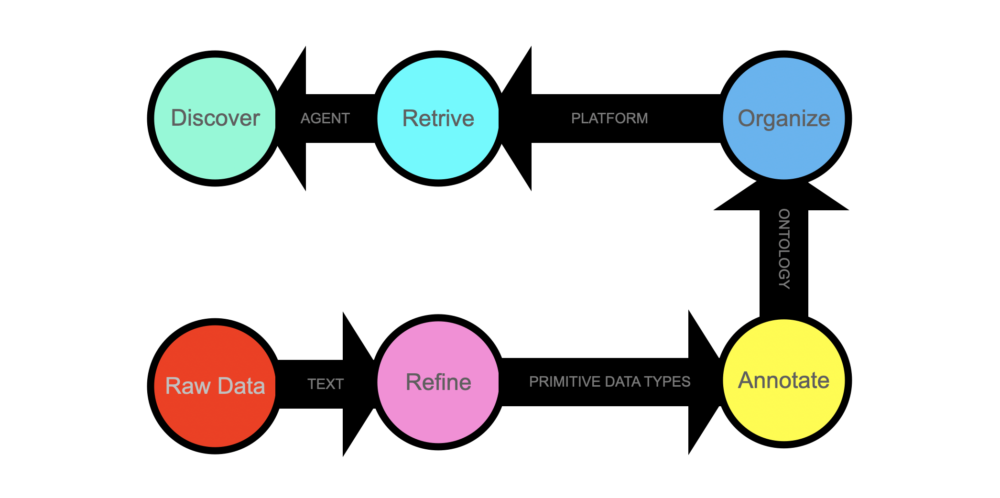

# 🧪 Welcome to My Raw Data to Discovery Lab Notebook

Think of this profile as an open engineering journal. I use these repositories to test edge cases, break bottlenecks, and document lessons learned. 

To keep the lab bench clean, all repositories start private. I open them up to the public as they pass internal validation checks and become clear enough to provide immediate utility or spark inspiration for your own builds.

These tools are functional experiments, but they are not production-hardened. For stable, production-ready software, check out my company's GitHub projects → [github.com/sas-quantome](https://github.com/sas-quantome).

###### October 7, 2026: main readme v107
